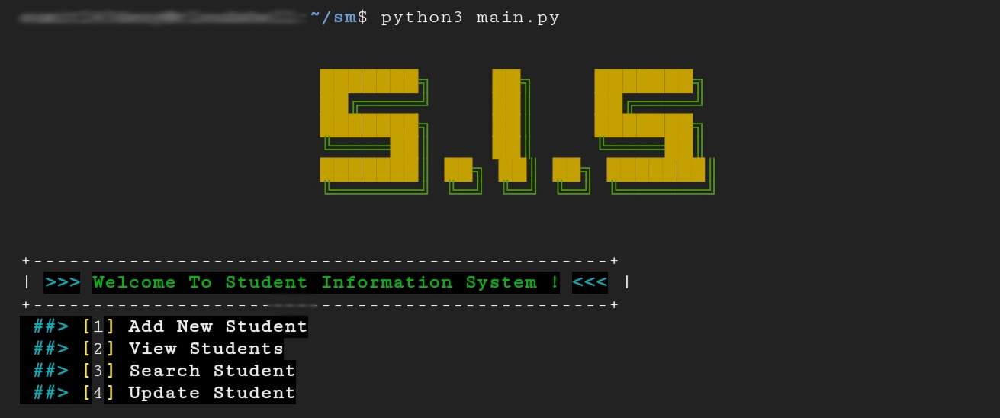
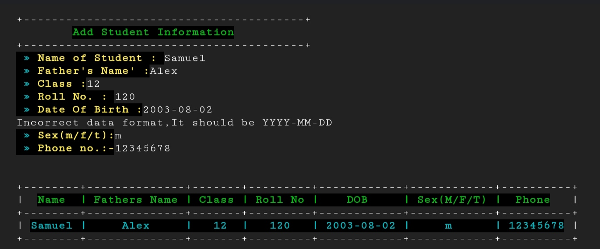
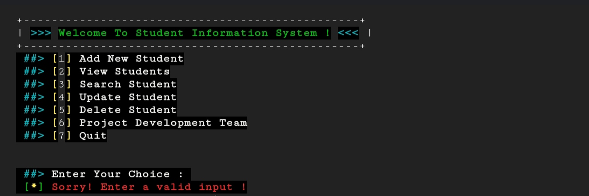

### Student-Management-System
### Preview

### Screenshots(old)

### Requirements
- <strong>Python3 + </strong>

### Installation & Running
<pre>
git clone https://github.com/Aashiv2004/Student-Management-System/

cd Student-Management-System

pip3 install -r requirements.txt

python3 main.py
</pre>

